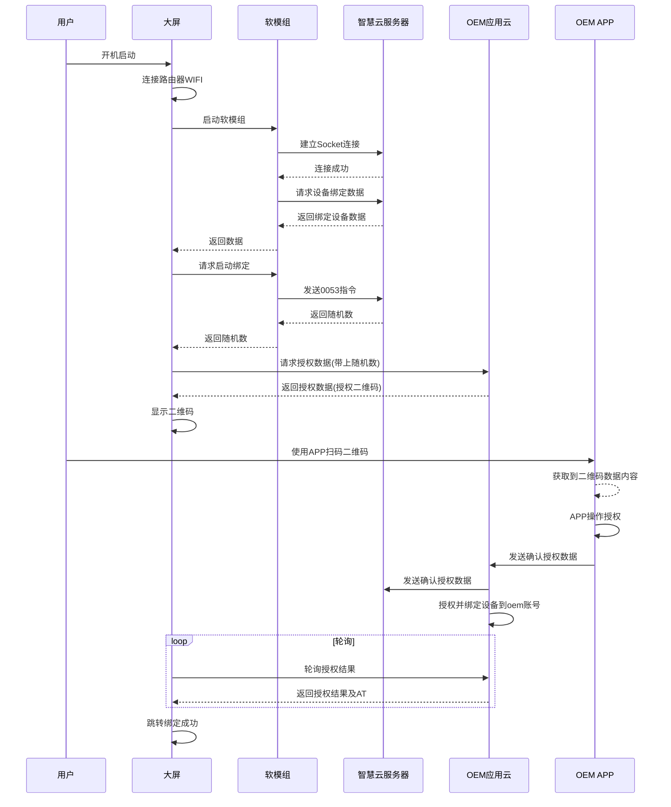

```mermaid
sequenceDiagram
    participant U as 用户
    participant D as 大屏
    participant M as 软模组
    participant S as 智慧云服务器
    participant A as OEM应用云
    participant P as OEM APP

    U->>D: 开机启动
    D->>D: 连接路由器WIFI
    D->>M: 启动软模组
    M->>S: 建立Socket连接
    S-->>M: 连接成功
    M->>S: 请求设备绑定数据
    S-->>M: 返回绑定设备数据
    M-->>D: 返回数据
    D->>M: 请求启动绑定
    M->>S: 发送0053指令
    S-->>M: 返回随机数
    M-->>D: 返回随机数
    D->>A: 请求授权数据(带上随机数)
    A-->>D: 返回授权数据(授权二维码)
    D->>D: 显示二维码
    U->>P: 使用APP扫码二维码
    P-->>P: 获取到二维码数据内容
    P->>P: APP操作授权
    P->>A: 发送确认授权数据
    A->>S: 发送确认授权数据
    A->>A: 授权并绑定设备到oem账号
    loop 轮询
        D->>A: 轮询授权结果
        A-->>D: 返回授权结果及AT
    end
    D->>D: 跳转绑定成功

```