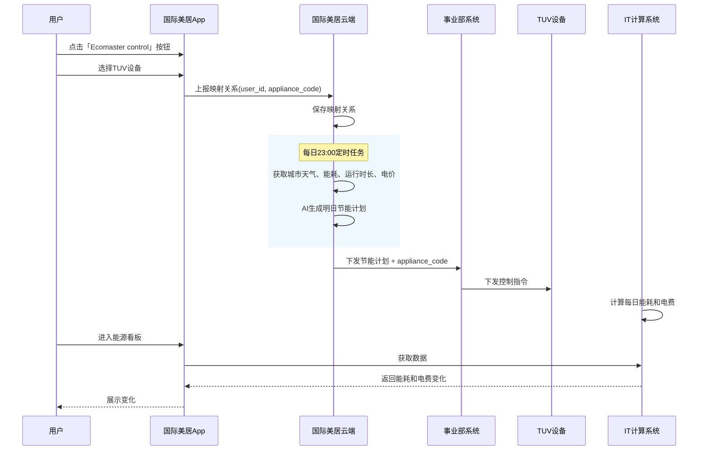

```mermaid
sequenceDiagram
    participant U as 用户
    participant App as 国际美居App
    participant Cloud as 国际美居云端
    participant BU as 事业部系统
    participant Device as TUV设备
    participant IT as IT计算系统

    U->>App: 点击「Ecomaster control」按钮
    U->>App: 选择TUV设备
    App->>Cloud: 上报映射关系(user_id, appliance_code)
    Cloud->>Cloud: 保存映射关系
    
    rect rgb(240, 248, 255)
        Note over Cloud: 每日23:00定时任务
        Cloud->>Cloud: 获取城市天气、能耗、运行时长、电价
        Cloud->>Cloud: AI生成明日节能计划
    end
    
    Cloud->>BU: 下发节能计划 + appliance_code
    BU->>Device: 下发控制指令
    
    IT->>IT: 计算每日能耗和电费
    U->>App: 进入能源看板
    App->>IT: 获取数据
    IT-->>App: 返回能耗和电费变化
    App-->>U: 展示变化

```