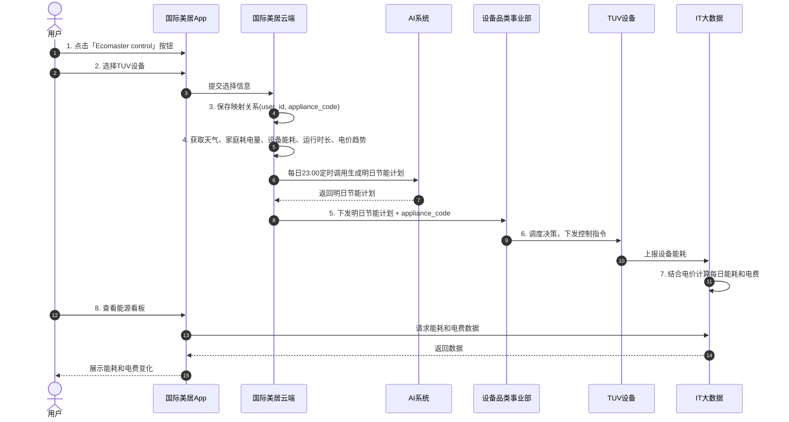

```mermaid
sequenceDiagram
    autonumber
    actor 用户 as 用户
    participant App as 国际美居App
    participant Cloud as 国际美居云端
    participant AI as AI系统
    participant Division as 设备品类事业部
    participant Device as TUV设备
    participant BigData as IT大数据

    用户->>App: 1. 点击「Ecomaster control」按钮
    用户->>App: 2. 选择TUV设备
    App->>Cloud: 提交选择信息
    Cloud->>Cloud: 3. 保存映射关系(user_id, appliance_code)
    Cloud->>Cloud: 4. 获取天气、家庭耗电量、设备能耗、运行时长、电价趋势
    Cloud->>AI: 每日23:00定时调用生成明日节能计划
    AI-->>Cloud: 返回明日节能计划
    Cloud->>Division: 5. 下发明日节能计划 + appliance_code
    Division->>Device: 6. 调度决策，下发控制指令
    Device->>BigData: 上报设备能耗
    BigData->>BigData: 7. 结合电价计算每日能耗和电费
    用户->>App: 8. 查看能源看板
    App->>BigData: 请求能耗和电费数据
    BigData-->>App: 返回数据
    App-->>用户: 展示能耗和电费变化

```