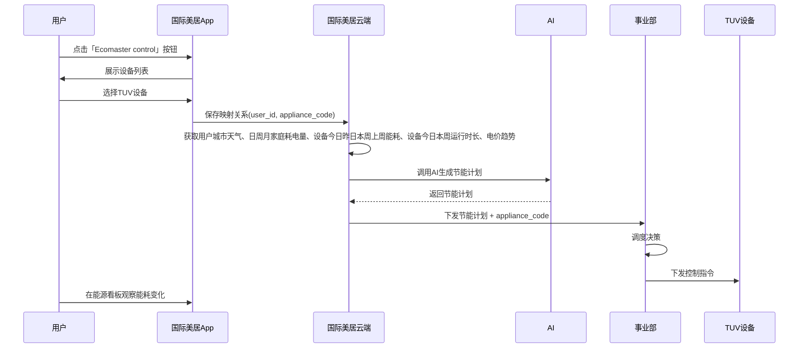

```mermaid
sequenceDiagram
    participant U as 用户
    participant App as 国际美居App
    participant Cloud as 国际美居云端
    participant AI as AI
    participant BU as 事业部
    participant Dev as TUV设备

    U->>App: 点击「Ecomaster control」按钮
    App->>U: 展示设备列表
    U->>App: 选择TUV设备
    App->>Cloud: 保存映射关系(user_id, appliance_code)
    Cloud->>Cloud: 获取用户城市天气、日周月家庭耗电量、设备今日昨日本周上周能耗、设备今日本周运行时长、电价趋势
    Cloud->>AI: 调用AI生成节能计划
    AI-->>Cloud: 返回节能计划
    Cloud->>BU: 下发节能计划 + appliance_code
    BU->>BU: 调度决策
    BU->>Dev: 下发控制指令
    U->>App: 在能源看板观察能耗变化

```