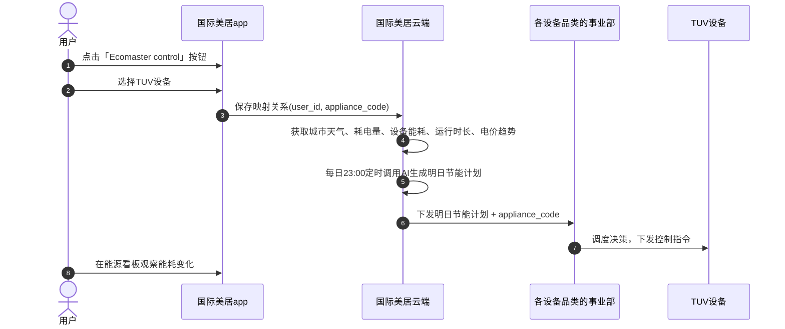

```mermaid
sequenceDiagram
    autonumber
    actor User as 用户
    participant App as 国际美居app
    participant Cloud as 国际美居云端
    participant BU as 各设备品类的事业部
    participant Device as TUV设备

    User->>App: 点击「Ecomaster control」按钮
    User->>App: 选择TUV设备
    App->>Cloud: 保存映射关系(user_id, appliance_code)
    Cloud->>Cloud: 获取城市天气、耗电量、设备能耗、运行时长、电价趋势
    Cloud->>Cloud: 每日23:00定时调用AI生成明日节能计划
    Cloud->>BU: 下发明日节能计划 + appliance_code
    BU->>Device: 调度决策，下发控制指令
    User->>App: 在能源看板观察能耗变化

```