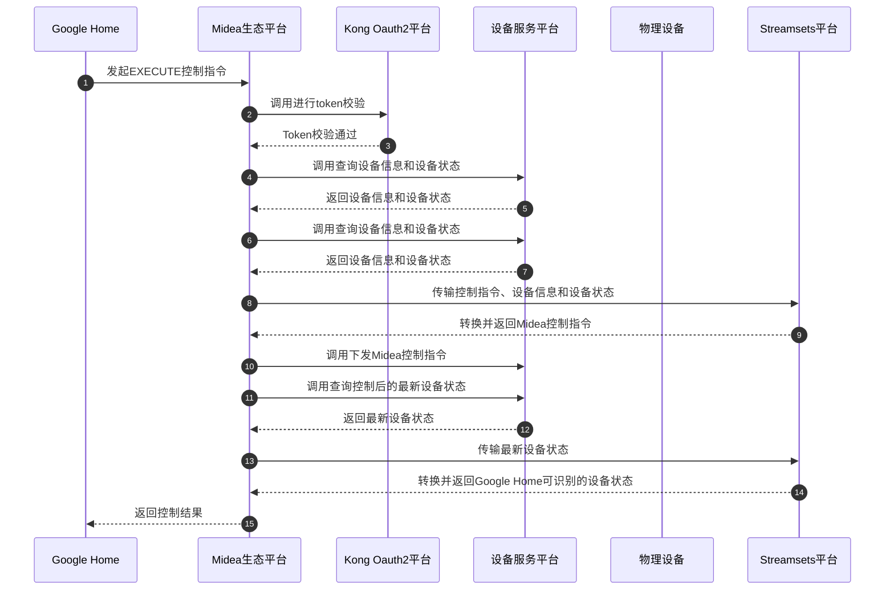

```mermaid
sequenceDiagram
    autonumber
    participant GoogleHome as Google Home
    participant MideaEco as Midea生态平台
    participant KongOAuth as Kong Oauth2平台
    participant DevService as 设备服务平台
    participant Device as 物理设备
    participant Streamsets as Streamsets平台

    GoogleHome->>MideaEco: 发起EXECUTE控制指令
    MideaEco->>KongOAuth: 调用进行token校验
    KongOAuth-->>MideaEco: Token校验通过
    MideaEco->>DevService: 调用查询设备信息和设备状态
    DevService-->>MideaEco: 返回设备信息和设备状态
    MideaEco->>DevService: 调用查询设备信息和设备状态
    DevService-->>MideaEco: 返回设备信息和设备状态
    MideaEco->>Streamsets: 传输控制指令、设备信息和设备状态
    Streamsets-->>MideaEco: 转换并返回Midea控制指令
    MideaEco->>DevService: 调用下发Midea控制指令
    MideaEco->>DevService: 调用查询控制后的最新设备状态
    DevService-->>MideaEco: 返回最新设备状态
    MideaEco->>Streamsets: 传输最新设备状态
    Streamsets-->>MideaEco: 转换并返回Google Home可识别的设备状态
    MideaEco-->>GoogleHome: 返回控制结果

```